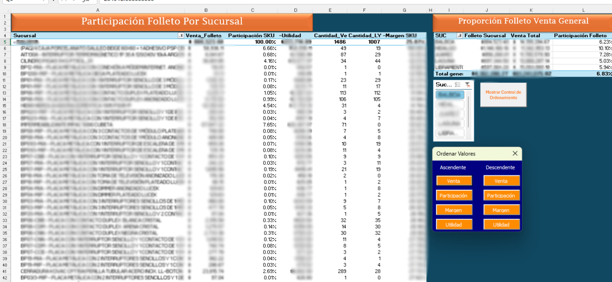

> **Versión en inglés al final de este documento.**  
> **English version at the end of this document.**

# Reporte_Dinámico_Folleto

Este proyecto fue desarrollado como respuesta a la limitante de acceso a datos crudos: permitiendo a los equipos visualizar el performance y cifras de los artículos en folleto para las tiendas de Reynosa.
# Reporte_Folleto – Semi-automatización de Reportes Comerciales en Excel & R

El reporte surge ante la situación de que solo fuera posible extraer cierta información desde reportes de Power BI proporcionados por TI, lo que obstaculiza la automatización directa y eficiente. Por ello, diseñé un **flujo semi-automatizado** que permite consolidar y transformar la información necesaria en pocos pasos, logrando que el reporte quede prácticamente listo al sustituir el rango de datos de la tabla dinámica en Excel.

La solución se implementó usando **RStudio** (para integración, limpieza y cálculo de campos clave) y **Excel** (como plantilla de reporte operativo), incorporando una macro simple para ordenar datos según las necesidades del cuerpo gerencial. El reporte fue solicitado como una solución rápida ante la carga y retrasos habituales del área de TI, permitiendo a los equipos visualizar el performance y cifras de los artículos en folleto para las tiendas de Reynosa.

---

## 🔧 Tecnologías y librerías utilizadas

- **R**: readr, dplyr, stringr, janitor, tidyr, readxl, writexl
- **Excel**: Tablas dinámicas, Macro simple de ordenamiento

---

## 🛠️ **Flujo de trabajo y chunks de código relevantes**

### 1. **Carga y pre-procesamiento del folleto**
```r
Folleto <- read_xlsx("Precios_Ofertas.xlsx")

Folleto <- Folleto %>%
  filter(`TIPO OFERTA` == "FOLLETO") %>%
  mutate(Codigo = as.character(Codigo)) %>%
  mutate(Codigo = if_else(tolower(Codigo) == "varios", "VARIOS", Codigo)) %>%
  mutate(`CÓDIGO COMBO` = if_else(is.na(`CÓDIGO COMBO`), Codigo, `CÓDIGO COMBO`)) %>%
  rename(
    Precio_Normal = DE,
    Precio_Oferta = A
  )
```
2. Carga y filtrado de ventas
```r
Copiar
Editar
Ventas_Folleto <- read_excel("Ventas_Folleto.xlsx")
Ventas_Folleto_filtrado <- Ventas_Folleto %>%
  filter(Sucursal %in% sucursales_interes) %>%
  rename(Codigo = `Codigo de Producto`)
```
3. Join entre ventas y folleto
```r
Copiar
Editar
Ventas_Cruzadas <- Ventas_Folleto_filtrado %>%
  inner_join(
    Folleto %>% select(Codigo, Descripcion, Precio_Normal, Precio_Oferta, `CÓDIGO COMBO`),
    by = c("Codigo" = "Codigo")
  )
```
4. Join con almacén y cálculo de métricas
```r
Copiar
Editar
Ventas_Promocion <- Ventas_Promocion %>%
  left_join(
    Almacen_filtrado %>%
      select(Codigo, Sucursal, Costo_de_Compra),
    by = c("Codigo", "Sucursal")
  ) %>%
  mutate(
    Costo_de_Venta = Cantidad * Costo_de_Compra,
    Utilidad_Oferta = Venta_Precio_Oferta_SinIVA - Costo_de_Venta,
    Margen_Oferta = round(ifelse(Venta_Precio_Oferta_SinIVA == 0, NA, Utilidad_Oferta / Venta_Precio_Oferta_SinIVA * 100), 2),
    Utilidad_Normal = Venta_Precio_Normal_SinIVA - Costo_de_Venta,
    Margen_Normal = round(ifelse(Venta_Precio_Normal_SinIVA == 0, NA, Utilidad_Normal / Venta_Precio_Normal_SinIVA * 100), 2)
  )
```
5. Cálculo de participación y exportación final
```r
Copiar
Editar
ventas_individuales_total <- Ventas_Todas %>%
  filter(Tipo_Registro != "Combo") %>%
  summarise(total = sum(ImporteVta, na.rm = TRUE)) %>%
  pull(total)

Ventas_Todas <- Ventas_Todas %>%
  mutate(
    Participacion_SKU = if_else(
      Tipo_Registro == "Combo",
      round(Venta_Precio_Oferta_ConIVA / ventas_individuales_total * 100, 2),
      Participacion_SKU
    )
  )

write_xlsx(Ventas_Todas, "Reporte_Ventas_Todas5.xlsx")
```

📊 Output final
El resultado es un archivo Excel con datos listos para análisis con tabla dinámica, permitiendo a los gerentes ordenar, filtrar y consultar el performance de artículos en folleto de manera rápida y sencilla.


📝 Macro UserForm de ordenamiento
Aunque Excel permite ordenar tablas dinámicas desde el menú contextual, este UserForm fue creado para facilitar la experiencia del usuario y agilizar el análisis, permitiendo ordenar la información clave con un solo clic. Esta mejora es especialmente útil en contextos donde el reporte es utilizado por perfiles no técnicos o donde se requiere rapidez y precisión operativa.

El archivo [`userform_ordenar_pivot.txt`](userform_ordenar_pivot.txt) contiene el código completo del UserForm para ordenar automáticamente las tablas dinámicas del reporte según diferentes criterios: venta, participación, margen y utilidad.

Instrucciones rápidas:
Abre el Editor de VBA en Excel (ALT + F11)

Inserta un nuevo UserForm y personaliza el fondo (azul navy)

Agrega los botones y nómbralos:

btnOrdenVentaAsc / btnOrdenVentaDesc

btnOrdenPartAsc / btnOrdenPartDesc

btnOrdenMargenAsc / btnOrdenMargenDesc

btnOrdenUtilAsc / btnOrdenUtilDesc

Pega el código del archivo .txt en el módulo del UserForm

Ajusta los nombres de las tablas dinámicas y campos según tu reporte

El UserForm está diseñado para posicionarse automáticamente en la hoja y aplicar el ordenamiento con solo hacer clic en los botones. Puede adaptarse fácilmente a cualquier tabla dinámica cambiando los nombres de los campos y la hoja objetivo.

🧠 Reflexión profesional
Este proyecto ejemplifica cómo, aún ante limitaciones de acceso y automatización, es posible resolver problemas reales del negocio integrando herramientas como R y Excel. Convertí una tarea que dependía del área de TI en un proceso semi-automático, ágil y amigable para el usuario final.
La solución fue muy bien recibida por el área comercial y demuestra la importancia de tener habilidades mixtas de análisis, integración de datos y foco en el usuario de negocio, especialmente en ambientes donde los recursos técnicos pueden ser limitados o lentos.

Nota:
Los datos han sido anonimizados y las imágenes editadas por motivos de confidencialidad. El flujo y la estructura del archivo reflejan la lógica implementada, no datos reales de la empresa.

## 📧 Contacto

reyes061295@gmail.com  
[LinkedIn](https://www.linkedin.com/in/marb951206/) | [GitHub](https://github.com/mreyes-analytics)

# Reporte_Dinámico_Folleto – Semi-automated Commercial Report in Excel & R

This project was developed in response to limited access to raw data—only certain information could be extracted from Power BI reports provided by the IT team, which blocked full automation. As a result, I designed a **semi-automated workflow** that consolidates and transforms the required data in a few steps, allowing the report to be ready for analysis simply by replacing the data range in the Excel pivot table.

The solution leverages **RStudio** (for data integration, cleaning, and calculation of key fields) and **Excel** (as an operational report template), with a simple macro to sort data according to management needs. This report was created as a fast-track solution to TI bottlenecks, enabling business teams to visualize the performance and figures for promotional catalog items across Reynosa stores.

---

## 🔧 Technologies and Libraries Used

- **R:** readr, dplyr, stringr, janitor, tidyr, readxl, writexl
- **Excel:** Pivot Tables, Simple Sorting Macro

---

## 🛠️ Workflow and Key Code Chunks

### 1. Load and Preprocess Promotional Catalog
```r
Folleto <- read_xlsx("Precios_Ofertas.xlsx")

Folleto <- Folleto %>%
  filter(`TIPO OFERTA` == "FOLLETO") %>%
  mutate(Codigo = as.character(Codigo)) %>%
  mutate(Codigo = if_else(tolower(Codigo) == "varios", "VARIOS", Codigo)) %>%
  mutate(`CÓDIGO COMBO` = if_else(is.na(`CÓDIGO COMBO`), Codigo, `CÓDIGO COMBO`)) %>%
  rename(
    Precio_Normal = DE,
    Precio_Oferta = A
  )
```

###2. Load and Filter Sales
```r
Copiar
Editar
Ventas_Folleto <- read_excel("Ventas_Folleto.xlsx")
Ventas_Folleto_filtrado <- Ventas_Folleto %>%
  filter(Sucursal %in% sucursales_interes) %>%
  rename(Codigo = `Codigo de Producto`)
```
###3. Join Sales and Catalog
```r
Copiar
Editar
Ventas_Cruzadas <- Ventas_Folleto_filtrado %>%
  inner_join(
    Folleto %>% select(Codigo, Descripcion, Precio_Normal, Precio_Oferta, `CÓDIGO COMBO`),
    by = c("Codigo" = "Codigo")
  )
```
###4. Join with Inventory and Metrics Calculation
```r
Copiar
Editar
Ventas_Promocion <- Ventas_Promocion %>%
  left_join(
    Almacen_filtrado %>%
      select(Codigo, Sucursal, Costo_de_Compra),
    by = c("Codigo", "Sucursal")
  ) %>%
  mutate(
    Costo_de_Venta = Cantidad * Costo_de_Compra,
    Utilidad_Oferta = Venta_Precio_Oferta_SinIVA - Costo_de_Venta,
    Margen_Oferta = round(ifelse(Venta_Precio_Oferta_SinIVA == 0, NA, Utilidad_Oferta / Venta_Precio_Oferta_SinIVA * 100), 2),
    Utilidad_Normal = Venta_Precio_Normal_SinIVA - Costo_de_Venta,
    Margen_Normal = round(ifelse(Venta_Precio_Normal_SinIVA == 0, NA, Utilidad_Normal / Venta_Precio_Normal_SinIVA * 100), 2)
  )
```
###5. Calculate Participation and Export Final Report
```r
Copiar
Editar
ventas_individuales_total <- Ventas_Todas %>%
  filter(Tipo_Registro != "Combo") %>%
  summarise(total = sum(ImporteVta, na.rm = TRUE)) %>%
  pull(total)

Ventas_Todas <- Ventas_Todas %>%
  mutate(
    Participacion_SKU = if_else(
      Tipo_Registro == "Combo",
      round(Venta_Precio_Oferta_ConIVA / ventas_individuales_total * 100, 2),
      Participacion_SKU
    )
  )
```
write_xlsx(Ventas_Todas, "Reporte_Ventas_Todas5.xlsx")
📊 Output
The result is an Excel file ready for analysis using a pivot table, allowing managers to quickly sort, filter, and review the performance of promotional catalog items.


###📝 UserForm Sorting Macro
While Excel natively allows pivot table sorting, this UserForm was created to improve the user experience and speed up analysis—making key sorting operations available with a single click. This enhancement is especially useful in settings where the report is used by non-technical profiles or where fast, accurate operations are needed.

The file userform_ordenar_pivot.txt contains the full UserForm code for automatically sorting pivot tables by sales, participation, margin, and profit.

Quick Setup:
Open the VBA Editor in Excel (ALT + F11)

Insert a new UserForm and set the background color (navy blue)

Add the following buttons and name them:

btnOrdenVentaAsc / btnOrdenVentaDesc

btnOrdenPartAsc / btnOrdenPartDesc

btnOrdenMargenAsc / btnOrdenMargenDesc

btnOrdenUtilAsc / btnOrdenUtilDesc

Paste the code from the .txt file into the UserForm module

Adjust the pivot table and field names as needed

The UserForm is designed to position itself automatically on the worksheet and apply sorting with just a button click. It can be easily adapted to any pivot table by changing field and sheet names.

🧠 Professional Reflection
This project demonstrates that—even with limited access and automation—it's possible to solve real business problems by integrating tools like R and Excel. I turned a task previously dependent on the IT area into a semi-automated, agile, and user-friendly process.
The solution was very well received by the commercial team and highlights the importance of hybrid skills in analysis, data integration, and business-focused thinking, especially where technical resources are limited or slow.

Note:
All data and screenshots have been anonymized or blurred for confidentiality. The workflow and file structure reflect the implemented logic, not the company's real data.

📧 Contact
reyes061295@gmail.com  
[LinkedIn](https://www.linkedin.com/in/marb951206/) | [GitHub](https://github.com/mreyes-analytics)
